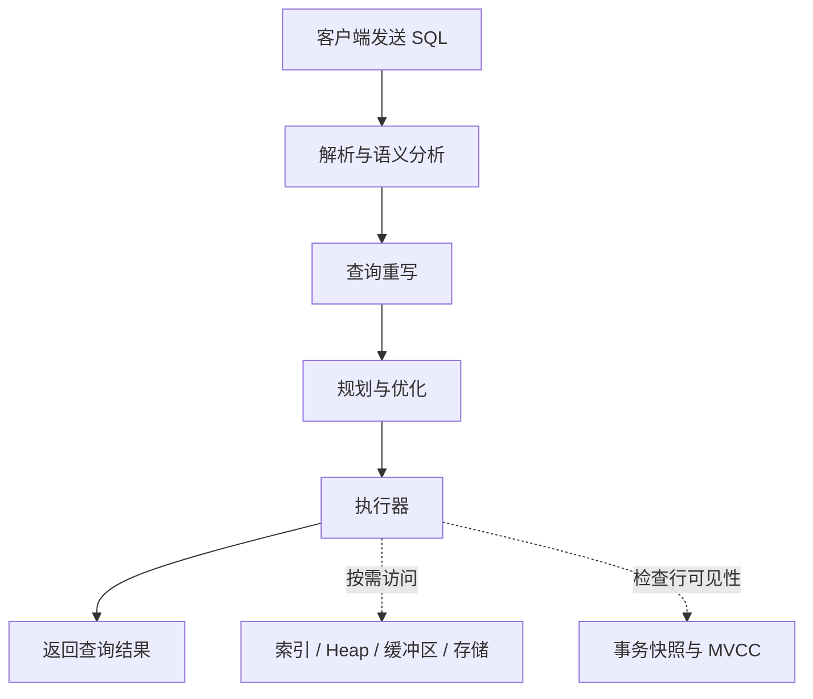
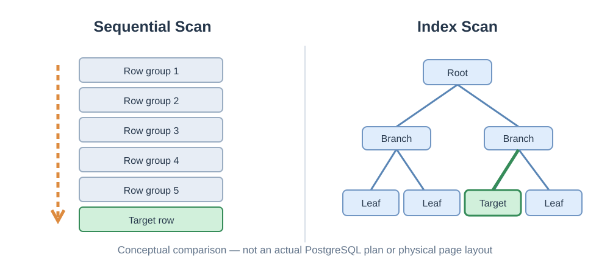
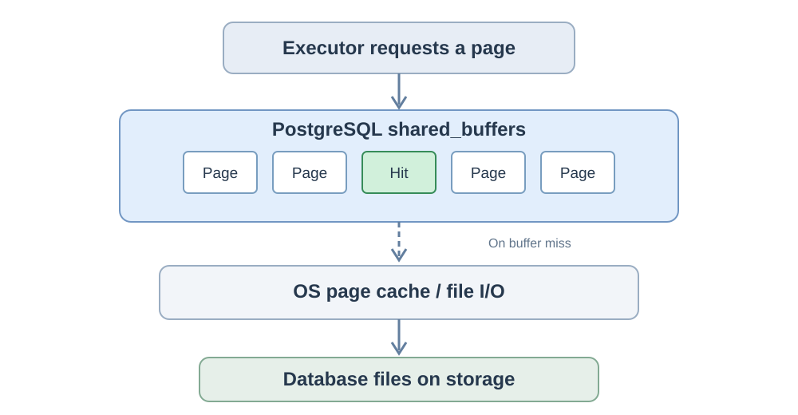

# 数据库的结构 01｜一条 SQL 语句，在数据库内部经历了什么？

我们每天都在使用数据库。一条查询写出来，按下回车，结果便出现在屏幕上。

```sql
SELECT * FROM users WHERE id = 100;
```

对于熟悉 SQL 的人来说，这实在太普通了。但仔细想一想，数据库收到的只是一段文本，它为什么知道应该去哪张表找数据？为什么同样的 SQL，有时使用索引，有时却扫描整张表？它读到的是内存里的数据，还是磁盘上的数据？如果另一个事务正在修改这条记录，它又应该返回哪个版本？

一条简单的 SELECT，背后其实有一套相当复杂的系统在协作。理解这条 SQL 的旅程，也就有了一张认识数据库内部结构的地图。

> 本文以 PostgreSQL 的普通表、常规 SELECT 查询为例。为了讲清主线，流程图省略了协议、计划缓存及部分执行细节；不同版本和查询形式的内部路径可能有所不同。



*图 1：一条典型 SELECT 的概念性处理路径。存储访问和可见性检查发生在执行过程中，不是查询完成后的两个独立阶段。*

## 一、数据库首先要读懂这句话

PostgreSQL 收到 `SELECT * FROM users WHERE id = 100` 时，并不会立即去磁盘上寻找编号为 100 的记录。首先，它要确认这段文字符合 SQL 的语法规则。

解析器识别关键字、表名、表达式，构造内部语法树。随后，分析阶段把名字与数据库中的对象对应起来：`users` 是否存在，`id` 是哪一列，`100` 应当怎样参与比较，当前用户是否具有相应权限。一个句子即使语法正确，也可能因为表或字段不存在而失败。

之后还有查询重写阶段。例如涉及视图或规则时，PostgreSQL 可能把查询转换成另一种内部表达。这里的“重写”不是简单替换 SQL 字符串，而是处理已经建立起来的查询结构。

到这一步，数据库已经理解我们**要什么**，但还没有决定**怎么做**。这正是声明式 SQL 的特点：我们描述结果，而不是逐条指挥数据库访问哪一个数据页。

## 二、为什么有索引，也不一定使用索引？

假设 `users` 只有一百行。要找到 `id = 100`，从头检查这些记录并不困难。如果表的数据页很少，顺序扫描可能比先访问索引、再跳转到表数据更省事。

现在把数据量增加到一百万行，情况就不同了。如果 `id` 上有合适的 B-Tree 索引，数据库通常能够先沿索引定位目标，再访问相应的表记录，避免检查大量无关数据。



*图 2：两种访问路径的概念对比，并非实际执行计划或 B-Tree 页布局。*

真正值得注意的是：索引存在，并不等于优化器必须使用它。如果查询要返回表中九成的数据，通过索引逐条访问 Heap，可能比直接扫描整张表更昂贵。

因此，PostgreSQL 的规划器会根据统计信息、表和索引规模、查询条件以及成本模型，估算可选路径的代价，选出预计更合适的执行计划。它并不是先把每种方案都运行一遍，再挑出最快的那个。

这解释了 DBA 经常遇到的一种现象：SQL 没变，执行计划却变了。因为数据量、分布、统计信息乃至规划参数可能已经变化。优化器不是在判断某个索引“好不好”，而是在特定条件下比较访问路径的预计成本。

## 三、我们能看到数据库的选择吗？

可以。PostgreSQL 的 `EXPLAIN` 会展示规划器选择的执行计划：

```sql
EXPLAIN SELECT * FROM users WHERE id = 100;
```

计划中可能出现 `Seq Scan`、`Index Scan`，也可能出现其他节点。它们代表不同的数据访问方式。

如果想知道真正执行时发生了什么，可以使用：

```sql
EXPLAIN (ANALYZE, BUFFERS)
SELECT * FROM users WHERE id = 100;
```

这里的 `ANALYZE` 会实际执行查询，并记录节点耗时、实际行数和执行次数；`BUFFERS` 则补充缓冲区访问统计。普通 `EXPLAIN` 主要给出计划和估算，不会执行这条 SELECT。

不过，执行计划不是数据库内部的一部完整录像。它能帮助我们分析执行器的行为，却不会逐项显示语法解析、每次函数调用或所有操作系统层面的 I/O。读懂工具的能力边界，与读懂工具本身同样重要。

## 四、做一个可以复现的实验

我们用一个小实验观察：表变大以后、索引创建以后，PostgreSQL 会不会改变访问路径？

先创建一张没有主键、也没有索引的测试表。这里故意不声明主键，因为 PostgreSQL 通常会为主键自动创建唯一索引。

```sql
DROP TABLE IF EXISTS users;
CREATE TABLE users (
    id INTEGER,
    username TEXT,
    email TEXT
);

INSERT INTO users (id, username, email)
SELECT i, 'user_' || i, 'user_' || i || '@example.com'
FROM generate_series(1, 100) AS i;
ANALYZE users;

EXPLAIN (ANALYZE, BUFFERS)
SELECT * FROM users WHERE id = 100;
```

接着把表扩展到一百万行：

```sql
INSERT INTO users (id, username, email)
SELECT i, 'user_' || i, 'user_' || i || '@example.com'
FROM generate_series(101, 1000000) AS i;
ANALYZE users;

EXPLAIN (ANALYZE, BUFFERS)
SELECT * FROM users WHERE id = 100;
```

最后建立索引，再比较一次：

```sql
CREATE INDEX idx_users_id ON users(id);
ANALYZE users;

EXPLAIN (ANALYZE, BUFFERS)
SELECT * FROM users WHERE id = 100;

EXPLAIN (ANALYZE, BUFFERS)
SELECT * FROM users WHERE id <= 900000;
```

我们预期，没有索引时会采用顺序扫描；建立索引后，查找单条记录通常更倾向于索引扫描；但返回大部分记录时，优化器仍可能选择顺序扫描。**这只是基于机制的预期，不是已验证的实验结果。** 实际计划还受到 PostgreSQL 版本、成本参数、数据分布和缓存状态影响。

完整脚本放在 [`experiments/01-sql-lifecycle/setup-and-queries.sql`](../experiments/01-sql-lifecycle/setup-and-queries.sql)，运行环境和待填写的真实结果记录在 [`results.md`](../experiments/01-sql-lifecycle/results.md)。正式发表实验结论时，应补上真实输出，而不是把示例或推测冒充测量数据。

## 五、执行器找到的究竟是什么？

假设优化器选择 `Index Scan`。执行器会按执行计划调用索引访问机制，沿 B-Tree 查找符合条件的索引条目。

在 PostgreSQL 常规 Heap 表中，普通 B-Tree 索引保存键值及指向表记录位置的引用，即 TID（Tuple Identifier）。它帮助数据库找到对应的 Heap 页和页内位置。也就是说，找到索引条目，通常还要进一步访问表中的记录。

这和 MySQL InnoDB 的聚簇索引设计有所不同。InnoDB 的主键索引叶子页组织着行记录，而 PostgreSQL 常规表的 Heap 与索引分别存储。两者都可以高效查询，但内部路径不一样。

PostgreSQL 也支持 `Index Only Scan`，在满足条件时减少 Heap 访问。不过，它是否需要进一步检查 Heap，与可见性映射等机制有关。这里先不展开，后面讨论索引时再深入。

## 六、数据页是在内存中，还是磁盘上？

执行器需要某个 Heap 页，并不意味着数据库马上向物理磁盘发起读取。PostgreSQL 有自己的共享缓冲区 `shared_buffers`，用于缓存数据库页面。

如果所需页面已经在共享缓冲区中，就可以访问缓存中的页面；如果没有，PostgreSQL 需要把页面读入共享缓冲区。但这个过程还可能命中操作系统文件缓存，并不一定触发真正的物理磁盘 I/O。



*图 3：简化的缓存层次。真实系统还涉及缓冲区管理、替换策略、文件系统和异步 I/O 等机制。*

这也是为什么两次执行同一条 SQL，耗时可能不一样。不过，不能简单说“第一次读磁盘、第二次读内存”，因为至少存在 PostgreSQL 共享缓冲区和操作系统页缓存两个层次。

`EXPLAIN (ANALYZE, BUFFERS)` 中的 `shared hit` 表示访问命中了 PostgreSQL 共享缓冲区；`shared read` 表示需要把页面读入共享缓冲区。后者并不等于实际发生了相同次数的物理磁盘读取。缓冲区统计也不等于互不重复的数据页数量。

这些看似细小的区别，在真正诊断性能问题时非常重要。

## 七、找到记录以后，为什么还不能直接返回？

还有最后一个容易被忽略的问题：找到的那条记录，对当前事务是否可见？

假设事务 A 正在修改某个用户信息，还没有提交；事务 B 此时读取同一个用户。B 应该看到什么？如果数据库不区分事务状态，直接返回某个物理位置上的内容，就可能破坏一致性读的要求。

PostgreSQL 使用 MVCC（多版本并发控制）来处理这类问题。Heap 中的行版本包含 `xmin`、`xmax` 等与事务有关的元数据，数据库结合事务状态、快照等信息判断某个版本是否可见。`xmin` 和 `xmax` 不能简单理解为“创建时间”和“删除时间”。

这也意味着，物理上存在一条记录，并不代表当前查询一定能看到它。更新后遗留的旧版本也需要后续清理，PostgreSQL 的 VACUUM 正是围绕这类问题发挥重要作用。

Oracle 和 MySQL InnoDB 同样需要解决一致性读，但其版本保存和恢复方式与 PostgreSQL 不完全相同。Oracle 使用 Undo 信息支持一致性读；InnoDB 依靠 Undo Log、Read View 等机制；PostgreSQL 常规 Heap 则保留多个行版本，并结合 VACUUM 管理其生命周期。理解这些差异，是我们后续研究事务的重要内容。

## 八、一条 SQL，背后是一套互相制约的系统

现在回头看最初的查询：

```sql
SELECT * FROM users WHERE id = 100;
```

它从文本开始，经过解析、分析、重写和规划；执行器按照选定的路径访问索引或 Heap；缓冲区管理机制帮助它获取页面；MVCC 决定哪些版本可以返回；最终结果才被发送给客户端。

这些模块不是简单串起来的一条流水线。执行器可能反复请求不同页面，存储访问与可见性检查穿插发生，复杂查询还会有连接、排序、聚合、并行执行等更多环节。第一张图只是我们进入这套系统的一张地图。

对于 DBA 来说，这张地图的价值在于：遇到性能问题时，不必只凭经验猜测。一条 SQL 变慢，可能是统计信息让优化器误判，也可能是访问路径不适合当前数据分布；可能是缓冲区行为改变，也可能是并发事务带来了额外工作。

“慢查询就加索引”“有索引就不能全表扫描”这样的经验，有时有用，有时却会把人带错方向。只有知道各个机制在做什么，才有可能找到真正的原因。

接下来的文章，我们会把这张地图逐步展开：数据为什么按 Page 组织，B-Tree 为什么适合索引，优化器如何估算成本，MVCC 如何判断可见性，WAL 和 Checkpoint 又怎样保证故障后的恢复能力。

我们以 PostgreSQL 作为主要实验平台，同时对照 Oracle 和 MySQL 的不同设计。目的不是背下更多术语，而是理解：**数据库为什么必须被设计成今天这个样子。**

真正理解一个复杂系统，往往始于看清一件最普通的事情是如何发生的。而我们的第一件事，就是一条 SQL。
